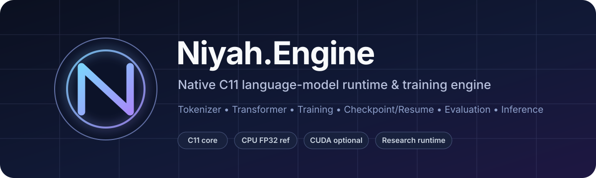
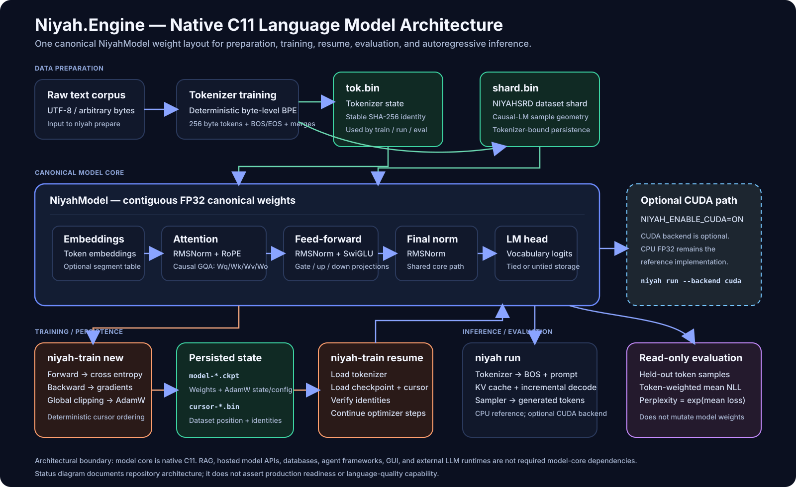

<p align="center">
  
</p>

<p align="center">
  <a href="https://github.com/Grar00t/Niyah.Engine/actions/workflows/ci.yml"></a>
  
  
  
  
</p>

<p align="center">
  <a href="docs/QUICKSTART.md"><b>Quickstart</b></a> ·
  <a href="docs/ARCHITECTURE.md">Architecture</a> ·
  <a href="docs/TRAINING.md">Training</a> ·
  <a href="docs/EVALUATION.md">Evaluation</a> ·
  <a href="docs/MODEL_CARD.md">Model Card</a> ·
  <a href="docs/DATA.md">Data</a> ·
  <a href="docs/CLI.md">CLI</a> ·
  <a href="docs/VERIFICATION.md">Verification</a>
</p>

# Niyah.Engine

**Niyah.Engine** is a native C11 autoregressive language-model runtime and training engine built from first principles around one canonical `NiyahModel` weight layout. Tokenization, Transformer execution, backward gradients, optimization, checkpoint/resume, evaluation, KV-cache decoding, sampling, and generation are implemented inside this repository.

No hosted-model API or external LLM runtime is required by the model core.

> [!IMPORTANT]
> Niyah.Engine is currently a **research runtime**, not a released general-purpose assistant. The project distinguishes implementation success from model-quality claims.

## Why Niyah.Engine

| Principle | What it means here |
|---|---|
| **Own the lifecycle** | Corpus preparation, tokenizer, model execution, training, persistence, evaluation, and inference are native project components |
| **One canonical model** | Training and inference operate on the same `NiyahModel` parameter layout |
| **Explicit state** | Tokenizer identity, dataset identity, checkpoint state, optimizer state, and dataset cursor are first-class contracts |
| **CPU reference first** | CPU FP32 defines the reference path; CUDA is optional rather than a core dependency |
| **Evidence before claims** | Tests and metrics are scoped to what they actually establish; broad capability is not inferred from a successful build |

## Architecture

<p align="center">
  
</p>

At a high level:

```text
raw corpus
    ↓
native byte-level BPE tokenizer
    ↓
tokenizer-bound dataset shard
    ↓
causal Transformer training
    ↓
checkpoint + dataset cursor
    ↓
resume / evaluate / inspect
    ↓
KV-cache autoregressive generation
```

The model core currently includes:

- contiguous FP32 model weights;
- RMSNorm;
- RoPE;
- causal grouped-query attention (GQA);
- SwiGLU feed-forward blocks;
- optional segment/role embeddings;
- causal cross-entropy and response-masked supervised loss;
- explicit backward gradients;
- global gradient clipping;
- AdamW;
- versioned checkpoint persistence;
- deterministic dataset cursor state;
- incremental KV-cache decode;
- greedy and seeded stochastic sampling.

See [Architecture](docs/ARCHITECTURE.md) for the full system boundary.

## Current status

| Area | Current evidence state |
|---|---|
| Native model core | Implemented and exercised |
| Tokenizer + dataset persistence | Implemented and exercised |
| Fresh training | Implemented and exercised |
| Checkpoint/resume | Implemented and exercised |
| CPU FP32 inference | Implemented and exercised |
| Optional CUDA backend | Implemented; evidence depends on the specific tested revision/configuration |
| Native evaluation API | Implemented and exercised |
| Diagnostic logit/KV probe | Implemented on current `main` |
| Held-out learning | Demonstrated on the current pilot validation distribution through step 1905 |
| Broad conversational quality | **Unestablished** |
| Broad reasoning capability | **Unestablished** |
| Production readiness | **Unestablished** |

## Diagnostic learning result

The current pilot has a measured four-checkpoint held-out trajectory:

| Checkpoint | Optimizer step | Mean loss | Perplexity |
|---|---:|---:|---:|
| `model-0200.ckpt` | 200 | 5.581078354 | 265.357600904 |
| `model-0635.ckpt` | 635 | 4.589545587 | 98.449683132 |
| `model-1270.ckpt` | 1270 | 3.942194185 | 51.531547081 |
| `model-1905.ckpt` | 1905 | 3.643954027 | 38.242751050 |

<p align="center">
  
</p>

Evaluation metadata:

```text
records                  = 30
samples                  = 292
prepared_tokens          = 17584
evaluated_target_tokens  = 17554
sequence_length          = 64
EVAL_EXIT                = 0
```

From step 1270 to 1905, held-out perplexity decreased from `51.5315` to `38.2428` (about **25.79%**).

**Interpretation:** this is evidence of continued learning on the measured distribution. It is **not** a claim of broad reasoning, factual reliability, or benchmark competitiveness. The set has also been used for continuation decisions, so it should now be treated as validation-like rather than as a pristine final test set.

See [Evaluation](docs/EVALUATION.md) for the full evidence boundary.

## Quickstart

### Build and test

```sh
cmake -S . -B build -DNIYAH_BUILD_TESTS=ON
cmake --build build --config Release
ctest --test-dir build -C Release --output-on-failure
```

### Prepare

```sh
niyah prepare \
  --corpus corpus.txt \
  --tokenizer-out tok.bin \
  --shard-out shard.bin \
  --target-vocab 269 \
  --min-pair-frequency 2 \
  --sequence-length 64
```

### Train

```sh
niyah-train new \
  --tokenizer tok.bin \
  --shard shard.bin \
  --checkpoint-out model.ckpt \
  --cursor-out cursor.bin \
  --updates 100 \
  --batch-size 32 \
  --accumulation-steps 4 \
  --model-seed 42 \
  --data-seed 42 \
  --context-length 64 \
  --embedding-dim 128 \
  --layers 4 \
  --heads 4 \
  --kv-heads 2 \
  --ffn-hidden-dim 512 \
  --rms-norm-eps 1e-5 \
  --tie-word-embeddings 1 \
  --learning-rate 0.0005 \
  --beta1 0.9 \
  --beta2 0.999 \
  --epsilon 1e-8 \
  --weight-decay 0.01 \
  --max-grad-norm 1.0
```

### Run

```sh
niyah run \
  --tokenizer tok.bin \
  --checkpoint model.ckpt \
  --prompt "Hello" \
  --max-new-tokens 32 \
  --temperature 0 \
  --seed 42 \
  --backend cpu
```

For the complete sequence including resume and diagnostics, use the [Quickstart](docs/QUICKSTART.md).

## Diagnostic probe

`niyah_probe` inspects the model without changing training or generation semantics:

```sh
niyah_probe \
  --tokenizer tok.bin \
  --shard shard.bin \
  --checkpoint model.ckpt \
  --prompt "A sequence is" \
  --topk 10 \
  --trace-steps 8
```

It can report shard unigram statistics, prompt token IDs, top next-token logits/probabilities, decoded token bytes, and an autoregressive KV-cache trace.

## Data quality matters

The current diagnostic pilot corpus is recorded as web/Hugging Face sourced and contains known quality defects. Successful optimization can therefore coexist with weak generated answers.

The project does **not** currently treat that corpus as a gold-quality assistant dataset.

See [Data, Provenance, and Quality Boundary](docs/DATA.md).

## CPU and CUDA

CPU FP32 is the reference implementation.

Optional CUDA support can be configured with:

```sh
cmake -S . -B build-cuda \
  -DNIYAH_BUILD_TESTS=ON \
  -DNIYAH_ENABLE_CUDA=ON
cmake --build build-cuda --config Release
```

A CUDA build does not, by itself, establish mixed-precision training, bitwise CPU/CUDA equivalence, or production accelerator readiness.

## CI

The repository `core-ci` workflow defines:

- Ubuntu Release build + test;
- Windows Release build + test;
- Ubuntu Debug build + AddressSanitizer + UndefinedBehaviorSanitizer tests.

At the documentation branch base (`732f84fc34b2b5cad2ac40b4195e293fc2fad9aa`), the `core-ci` push workflow completed successfully. GitHub CodeQL also completed successfully for that push.

See [Verification](docs/VERIFICATION.md) for the exact evidence snapshot.

## Documentation

| Document | Contents |
|---|---|
| [Documentation Index](docs/README.md) | Map of the complete documentation set |
| [Quickstart](docs/QUICKSTART.md) | Build → prepare → train → resume → run → inspect |
| [Architecture](docs/ARCHITECTURE.md) | Model/data/training/inference system design |
| [Training](docs/TRAINING.md) | Update semantics, checkpoint/cursor lifecycle, reproducibility |
| [Evaluation](docs/EVALUATION.md) | Metrics, pilot trajectory, validation/test discipline |
| [Model Card](docs/MODEL_CARD.md) | Model/runtime classification, current capability status, limitations |
| [Data](docs/DATA.md) | Provenance, quality risks, corpus acceptance requirements |
| [CLI](docs/CLI.md) | Current source-backed command reference |
| [Verification](docs/VERIFICATION.md) | Repository CI + local diagnostic evidence ledger |

## Repository layout

```text
include/niyah/       Public C API
src/                 Native model/runtime implementation
tools/               CLI, trainer, diagnostics, CUDA benchmark utility
tests/               Native regression tests
docs/                Architecture, training, evaluation, model/data documentation
.github/workflows/   CI configuration
```

## Architectural boundary

Niyah.Engine does not require these components to implement its native language-model lifecycle:

- PyTorch;
- Hugging Face Transformers runtime;
- llama.cpp;
- Qwen/Llama/Mistral model runtimes;
- hosted model APIs;
- RAG/vector databases;
- PostgreSQL/document services;
- agent frameworks;
- GUI shells;
- HTTP serving infrastructure.

Applications may add those systems externally when a concrete requirement exists.

## Explicit non-claims

Current evidence does **not** establish:

- production readiness;
- broad conversational competence;
- broad reasoning capability;
- factual reliability;
- final Arabic or English language quality;
- distributed training;
- mixed-precision training correctness;
- CPU/CUDA bitwise equivalence;
- parity or superiority versus Qwen, Llama, GPT-family, or another established model family.

## Project direction

Niyah.Engine asks a narrow systems question:

> **Can a small, auditable native implementation own the complete language-model lifecycle without delegating its core semantics to an external LLM runtime?**

The repository approaches that question through explicit formats, native execution, deterministic state, regression tests, and progressively stronger evaluation evidence.
