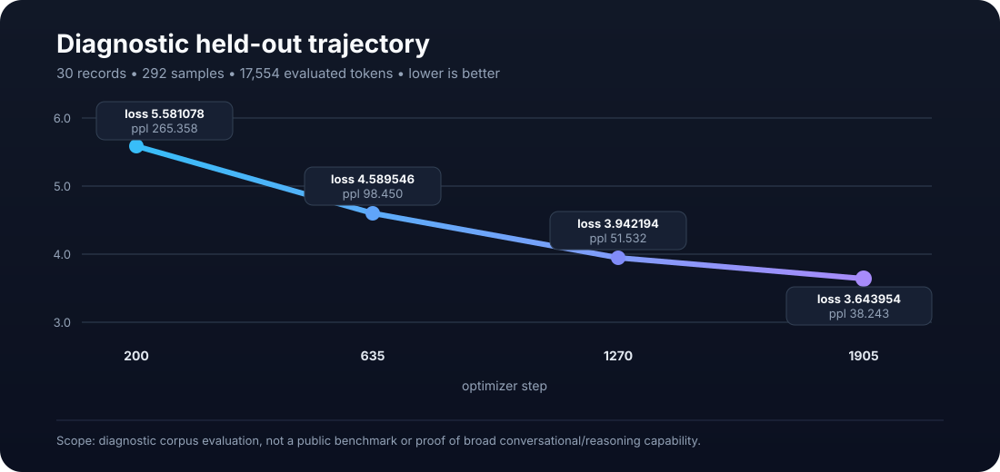

# Evaluation

This document defines how Niyah.Engine evaluation results should be interpreted and records the current pilot held-out trajectory without promoting it into a broader benchmark claim.

## Metric definition

The native evaluation primitive reports token-weighted mean cross-entropy and perplexity:

```text
mean_loss  = total negative log-likelihood / evaluated target-token count
perplexity = exp(mean_loss)
```

Lower values are better **for the same evaluation distribution and objective semantics**.

A lower perplexity value does not automatically mean that generated answers are factually correct, conversationally useful, safe, or better than another model evaluated on different data.

## First-class evaluation CLI

The repository exposes read-only evaluation through:

```text
niyah eval --tokenizer TOK --checkpoint CKPT --heldout FILE
    [--format text|shard]
    [--sequence-length N]
```

The command reports stable `key=value` output containing tokenizer, checkpoint, and held-out identities plus model metrics. Successful evaluation ends with `EVAL_EXIT=0`.

Text mode hashes the supplied raw held-out bytes, builds an evaluation shard in memory, and can report bits per byte. Shard mode loads a tokenizer-compatible prepared shard, uses its stored sequence length, reports its semantic shard identity, and does not invent a raw-byte denominator.

Evaluation does not update model parameters, optimizer state, or checkpoint bytes. The CLI integration test evaluates the same checkpoint repeatedly and verifies its file hash remains unchanged.

## Add-1 bigram baseline

`niyah eval` reports a sparse Laplace/add-1 bigram baseline on the **same token stream** used to build the evaluation shard. For each adjacent pair `(previous, next)`:

```text
P(next | previous)
    = (pair_count(previous,next) + 1)
      / (outgoing_count(previous) + vocab_size)
```

The baseline mean NLL is averaged across all adjacent transitions in that stream. The implementation sorts encoded observed token pairs and does not allocate a `vocab_size × vocab_size` table.

The baseline is deliberately simple. Beating it is useful evidence that the model captures more predictive structure than a smoothed first-order token model on that stream; it is not a claim of broad language competence.

For text mode:

```text
bits_per_token          = mean_loss / ln(2)
baseline_bits_per_token = baseline_mean_loss / ln(2)
```

Bits per byte uses the raw held-out byte count as the denominator. Shard mode omits both bits-per-byte fields.

## Current pilot evaluation set

The reported diagnostic run used:

```text
records                  = 30
prepared_tokens          = 17584
samples                  = 292
sequence_length          = 64
evaluated_target_tokens  = 17554
```

All four checkpoints were evaluated against the same prepared held-out set using the same diagnostic evaluation helper. These historical measurements predate the first-class `niyah eval` CLI and are not retroactively represented as CLI output.

## Checkpoint trajectory

| Checkpoint | Step | Mean loss | Perplexity | Relative interpretation |
|---|---:|---:|---:|---|
| `model-0200.ckpt` | 200 | 5.581078354 | 265.357600904 | Early checkpoint |
| `model-0635.ckpt` | 635 | 4.589545587 | 98.449683132 | Large improvement |
| `model-1270.ckpt` | 1270 | 3.942194185 | 51.531547081 | Continued improvement |
| `model-1905.ckpt` | 1905 | 3.643954027 | 38.242751050 | Best measured checkpoint in this series |

<p align="center">
  
</p>

From step 1270 to 1905:

```text
loss change        = -0.298240158 nats
perplexity change  = 51.531547081 -> 38.242751050
relative ppl drop  ≈ 25.79%
```

The historical evaluation process exited successfully:

```text
EVAL_EXIT=0
```

## Evidence-supported conclusion

The measured trajectory demonstrates **continued improvement on this evaluation distribution** through optimizer step 1905. The sequence is monotonic across all four measured checkpoints.

This is stronger evidence than training-loss reduction alone because the measured records were held outside the training corpus used by the run.

## Validation-set status

The 30-record set has been used repeatedly to decide whether training should continue. That makes it operationally closer to a **validation set** than to a pristine final test set.

For a final model-quality claim, use a second set that remains untouched until the candidate training configuration is frozen.

Recommended separation:

```text
training set
    used for gradient updates

validation set
    used for checkpoint selection / continuation decisions

test set
    used once after training decisions are frozen
```

## Training loss vs. held-out loss

The 1270→1905 resume stage reported:

```text
mean training loss = 3.74314785
held-out loss      = 3.643954027
```

The fact that held-out loss is slightly lower than the reported training mean is not, by itself, evidence of exceptional generalization or an error. The two numbers can differ because of record difficulty, masking, sample distribution, and averaging semantics.

The evidence-supported statement is narrower: **there is no observed held-out regression at step 1905 on this validation distribution.**

## Per-update training noise

Individual update losses in the 1270→1905 stage vary materially. Examples include values in roughly the mid-3 range with occasional values near or above 4.

A single final minibatch/update loss should therefore not be used as the primary quality gate. Prefer:

1. stage/epoch mean training loss;
2. fixed validation-set loss;
3. final untouched test-set loss;
4. task-specific generation evaluation when the target application is defined.

## Generation quality is a separate measurement

Loss/perplexity measures next-token prediction under the evaluation objective. It does not directly measure:

- factual correctness;
- instruction following;
- reasoning;
- style quality;
- multilingual fluency;
- refusal behavior;
- hallucination frequency;
- safety properties.

Those require separate task-specific evaluation data and acceptance criteria.

## Data quality caveat

The current pilot corpus is known to contain quality defects. A model can become better at predicting a low-quality corpus while still producing low-quality answers.

Therefore this evaluation is primarily evidence that:

```text
model optimization works
+ learned behavior transfers to the held-out validation distribution
```

It is not evidence that the underlying corpus is suitable for a final assistant model.

## Next rigorous gate

After the next selected checkpoint, preserve the evaluator unchanged and record:

```text
checkpoint identity
validation loss/perplexity
add-1 bigram baseline on the same token stream
untouched test loss/perplexity
generation results on fixed unseen prompts
exact repository revision
exit status
```

Do not tune against the final test set after observing its result.

## Current non-claims

No current evaluation in this repository establishes:

- benchmark leadership;
- parity with Qwen, Llama, GPT-family, or other established model families;
- broad generalization across domains;
- production reliability;
- safety or alignment quality.
