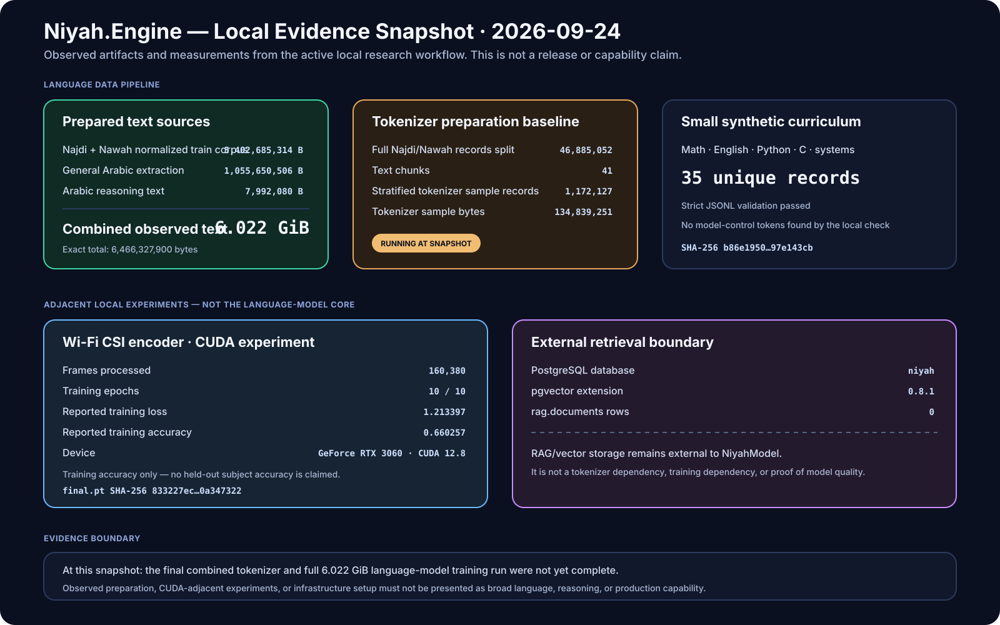

# Local Evidence Snapshot — 2026-09-24

This document records a dated **local research-workflow snapshot**. It exists to preserve what was actually observed during corpus preparation, adjacent CUDA experiments, and external retrieval setup without turning those observations into broader model-quality claims.

> [!IMPORTANT]
> This snapshot is not a release note, benchmark result, or statement that the current `main` branch produced every local artifact below. Repository behavior must still be tied to source/tests/CI for a named commit. Local experiment evidence is identified separately.

<p align="center">
  
</p>

## Snapshot summary

| Area | Observed state | What it establishes |
|---|---|---|
| Najdi + Nawah normalized training text | `5,402,685,314` bytes | Large local dialect-oriented text corpus exists |
| General Arabic extraction | `1,055,650,506` bytes | Additional broad Arabic text exists as a separate source |
| Arabic reasoning text | `7,992,080` bytes | Small reasoning-oriented supplement exists |
| Combined observed text | `6,466,327,900` bytes (`6.022 GiB`) | Source material is materially larger than the earlier pilot corpus |
| Najdi/Nawah split | `46,885,052` records across `41` chunks | Full source was split into bounded text chunks |
| Baseline tokenizer sample | `1,172,127` records / `134,839,251` bytes | A bounded tokenizer-training sample was prepared |
| Baseline tokenizer job | Running at snapshot time | No tokenizer-success claim is made here |
| Synthetic curriculum | `35` unique records | Small validated math/English/code seed set exists |
| PostgreSQL + pgvector | pgvector `0.8.1`; `rag.documents=0` | External retrieval storage is initialized but not populated |
| Wi-Fi CSI experiment | `160,380` frames; `10/10` epochs | Separate CUDA training experiment completed |

## Language-data preparation

The local language-data workflow currently separates three text sources:

```text
Najdi + Nawah normalized train corpus     5,402,685,314 bytes
General Arabic extraction                 1,055,650,506 bytes
Arabic reasoning supplement                   7,992,080 bytes
                                        -----------------
Combined observed text                    6,466,327,900 bytes
                                                6.022 GiB
```

The Najdi/Nawah corpus was split at record boundaries into `41` bounded text chunks. The split reported `46,885,052` records. A stratified tokenizer sample contained `1,172,127` records and `134,839,251` bytes.

The full Najdi/Nawah normalized training corpus was identified locally with SHA-256:

```text
c5fbce87a8412af4a5bc34ebde6043e3ad6998b48251fc5b8c27be6a55266b4f
```

At the time of this snapshot, the baseline tokenizer preparation process was still consuming CPU and had not yet emitted a success receipt. Accordingly, this document does **not** claim that the final tokenizer, final shards, or full language-model training run had completed.

## General Arabic and reasoning supplements

The general-Arabic extraction retained `188,460` source rows and produced:

```text
general-arabic.txt
bytes   = 1,055,650,506
sha256  = 892fe5bd0a3ff69573554d160a3a4ed0ed99cebc8061d6d6945630644fb4bdae
```

The reasoning supplement retained `7,771` text records after local extraction and produced:

```text
reasoning-clean.txt
bytes   = 7,992,080
sha256  = 92903f61c9f81fecbcf990e855d905eb56b5ad851283b9a650f628a29d3b1e08
```

A text scan did not find the explicit model/vendor identity strings targeted by that local check. That is a narrow content check only; it is not a license determination and does not erase source provenance.

## Synthetic curriculum seed

A small project-generated JSONL seed set was validated after blank-line cleanup:

```text
records         = 35
unique_records  = 35
bytes           = 7,036
sha256          = b86e195017acd5c711520dddb290ef509c88d3d9a2e66f913b47b0aa97e143cb
```

Categories include arithmetic, algebra, geometry, probability, logic, English grammar/vocabulary, Python, C, algorithms, debugging, and systems concepts.

The curriculum is intentionally small. It should be treated as a seed/evaluation-support artifact rather than evidence of broad reasoning capability.

## Adjacent CUDA experiment: Wi-Fi CSI encoder

A separate Wi-Fi CSI experiment completed on an NVIDIA GeForce RTX 3060 using PyTorch CUDA 12.8. This experiment is **not part of the Niyah language-model core** and is recorded only because it is part of the same local research environment.

Observed completion receipt:

```text
CSI_FRAMES            = 160380
PARAMETERS            = 344507
EPOCH                  = 10/10
TRAINING_LOSS          = 1.213397
TRAINING_ACCURACY      = 0.660257
TRAINING_COMPLETE      = YES
```

Final artifact identity:

```text
csi-encoder-final.pt
bytes   = 1,392,639
sha256  = 833227ec33e1c0a20f4aefafb1af2a3f61ad8c217856543ce881d8680a347322
```

The reported `0.660257` value is **training accuracy**, not held-out subject accuracy. No held-out generalization claim follows from it.

## External retrieval boundary

The local PostgreSQL foundation is intentionally external to the model core:

```text
database              = niyah
pgvector               = 0.8.1
rag.documents rows     = 0
```

The current separation is deliberate:

```text
Niyah model core
  ├─ tokenizer
  ├─ dataset shards
  ├─ training / checkpoint / cursor
  └─ inference / evaluation

External application layer
  └─ PostgreSQL + pgvector RAG
```

PostgreSQL, pgvector, and RAG are therefore not presented as tokenizer dependencies, optimizer dependencies, or evidence of model quality.

## Evidence boundary

As of this snapshot, the following remain **unestablished** by the evidence recorded here:

- successful completion of the final combined tokenizer;
- successful sharding of the complete `6.022 GiB` combined language corpus;
- a complete full-corpus Niyah language-model training receipt;
- held-out broad Arabic or English quality;
- broad reasoning quality;
- native CUDA optimizer-training parity for the Niyah language-model trainer;
- production readiness.

A future full-training receipt should include, at minimum:

1. exact tokenizer SHA-256;
2. shard manifest and aggregate token/sample counts;
3. model configuration;
4. optimizer configuration and optimizer-step count;
5. actual execution backend used for optimization;
6. checkpoint SHA-256;
7. independent held-out evaluation results;
8. repository commit SHA used for the run.

## Why this page exists

The project has enough moving parts that attractive diagrams, successful builds, or isolated training logs can be mistaken for a stronger claim than they support. This page deliberately records **state, identities, and boundaries** so that later documentation can distinguish preparation from training, training from evaluation, and adjacent experiments from the model core.
