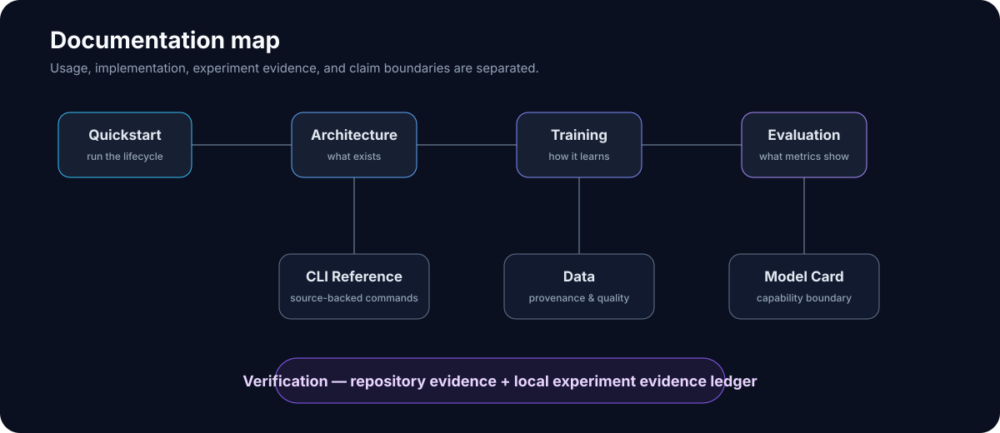

# Niyah.Engine Documentation

Niyah.Engine is a native C11 language-model implementation that owns its tokenizer, Transformer execution, training loop, checkpoint/resume path, evaluation primitive, and autoregressive inference runtime.

This documentation is organized to separate **how the system works** from **what has actually been demonstrated**.

  

## Start here

| Guide | Purpose |
|---|---|
| [Quickstart](QUICKSTART.md) | Build, test, prepare a corpus, train, resume, run inference, and use the diagnostic probe |
| [Architecture](ARCHITECTURE.md) | Canonical model layout, tokenizer, dataset, Transformer, training, checkpointing, inference, CPU/CUDA boundaries |
| [Training](TRAINING.md) | Fresh training, accumulation semantics, persistence, resume, and reproducibility |
| [Evaluation](EVALUATION.md) | Metric definitions, diagnostic held-out trajectory, interpretation rules, and test-set discipline |
| [Model Card](MODEL_CARD.md) | Current model/runtime status, demonstrated capabilities, limitations, and intended research use |
| [Data](DATA.md) | Dataset contracts, provenance requirements, quality risks, and current diagnostic-corpus caveats |
| [Arabic Heritage Stack](ARABIC_HERITAGE_STACK.md) | License/provenance boundary for Arabic morphology tools, dictionaries, databases, and training use |
| [CLI Reference](CLI.md) | `niyah`, `niyah-train`, and `niyah_probe` command surfaces currently present in the repository |
| [Verification](VERIFICATION.md) | Evidence ledger: what has passed, what is locally observed, and what remains unestablished |
| [Project Identity](IDENTITY.md) | Project mark, cultural origin, artifact provenance rules, cryptographic verification boundary, and usage guidance |
| [Local Evidence Snapshot — 2026-09-24](LOCAL_EVIDENCE_2026-09-24.md) | Dated local corpus, tokenizer-preparation, CUDA-adjacent, synthetic-data, and external-RAG evidence with explicit claim boundaries |
| [FAQ](FAQ.md) | Direct answers to common architecture, training, data, and capability questions |
| [Contributing](../CONTRIBUTING.md) | Patch scope, regression gates, platform evidence, and claim discipline |

## Documentation rule

Niyah.Engine documentation uses three evidence levels:

- **Implemented** — behavior exists in source code.
- **Verified** — behavior has reproducible build/test/runtime evidence.
- **Unestablished** — no adequate evidence currently supports the claim.

Implementation does not automatically imply model quality. A successful training run proves that the optimization path executed; a falling held-out loss provides stronger evidence of learning on that evaluation distribution; neither alone proves broad language, reasoning, safety, or production readiness.

## Current high-level status

| Area | Status |
|---|---|
| Native C11 model runtime | Implemented and exercised |
| Native tokenizer and dataset persistence | Implemented and exercised |
| Fresh training and resume | Implemented and exercised |
| CPU FP32 reference path | Implemented and exercised |
| Optional CUDA path | Implemented; scope depends on the specific build/test evidence |
| Held-out diagnostic learning | Demonstrated on the current pilot evaluation set through optimizer step 1905 |
| Broad conversational quality | Unestablished |
| Broad reasoning capability | Unestablished |
| Production readiness | Unestablished |

## Evidence sources

Repository behavior should be grounded in source, tests, and CI for a named commit. Local model experiments should separately identify their model/data/evaluation artifacts. When the exact repository SHA used for a local experiment is missing from the available transcript, the documentation states that limitation rather than assigning a SHA retroactively.

Dated local snapshots live alongside the durable architecture/training documentation rather than replacing it. They may contain work-in-progress states such as a tokenizer build that was still running at capture time; those states are labeled explicitly.

## Repository documentation philosophy

The project intentionally avoids presenting architecture diagrams, passing tests, or attractive generated text as proof of capability beyond the evidence they establish. Claims should remain reproducible from repository state, commands, artifact identities, and evaluation records.
